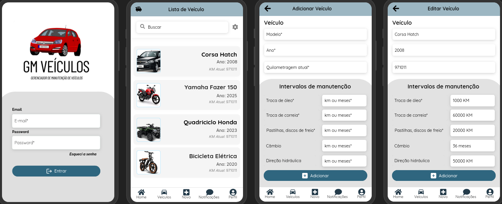

# Pós em Desenvolvimento de Aplicativos Móveis

## Matéria: Desenvolvimento Multiplataforma com Flutter 

### Unidade 02 - Atividade 2 - Finalizada

**Tarefa:** Desenvolver um projeto de aplicativo com operações básicas de manipulação de dados (listar, inserir, ler, atualizar e excluir), incluindo autenticação para acesso restrito a usuários cadastrados.

**Requisitos:**
- Breve descrição do aplicativo, objetivos e motivações.
- Protótipos de tela (digitais ou desenhados à mão).
- Organização do projeto em um arquivo PDF, estruturado como uma proposta para investidores.

---

## GM Veículos

### Proposta de Projeto: GM Veículo - Gerenciador de Manutenção de Veículos

**Descrição:**  
O GM Veículo é um aplicativo para gerenciar a manutenção preventiva de veículos (carros, motos, quadriciclos, etc.), com lembretes personalizados baseados em quilometragem ou tempo. O objetivo é evitar esquecimentos críticos, como troca de óleo, filtros, pastilhas de freio e outras revisões periódicas.

**Protótipo:**

---

### Unidade 03 - Atividade 3 - Finalizada

**Tarefa:** Implementar o aplicativo projetado na unidade anterior.

**Requisitos:**
- Navegação entre as telas projetadas.
- Não é necessário persistência de dados ou autenticação.
- Enviar o projeto compactado (excluindo diretórios `.dart_tool`, `.idea`, `.build`) ou fornecer o link de um repositório público.

